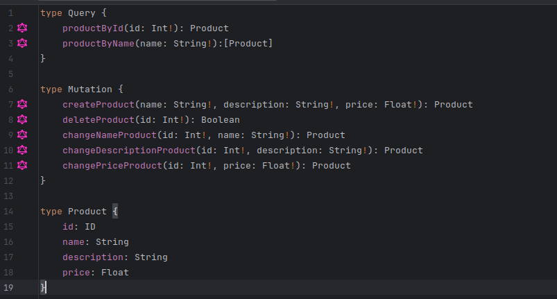

:spring_version: current
:project_id: gs-graphql-server
:icons: font
:source-highlighter: prettify
 
== How to Run This Project

You will build a service that will accept GraphQL requests at `http://localhost:8080/graphql`.

=== Prerequisites
Before running the project, ensure you have the following installed:

- Java 17 or later
- Maven 3.6+
- Docker (optional, if using containers for database)
- An IDE such as IntelliJ IDEA or VS Code

=== Schema



=== Running the Project Locally

1. **Clone the Repository:**
   ```sh
   git clone git@github.com:eulerBM/Graphql.git
   cd gs-graphql-server
   ```

2. **Build the Project:**
   ```sh
   mvn clean install
   ```

3. **Run the Application:**
   ```sh
   mvn spring-boot:run
   ```

4. **Access GraphQL Endpoint:**
   Open your browser or use a tool like Postman to send requests to:
   ```
   http://localhost:8080/graphql
   ```
   You can also use GraphiQL (if enabled) at:
   ```
   http://localhost:8080/graphiql
   ```

=== Running with Docker
If your project requires a database or other dependencies, you can use Docker Compose:

```sh
docker-compose up -d
```

=== Environment Variables
Ensure you set up any necessary environment variables before running the application. You can configure them in the `application.properties` or `application.yml` file.

=== Running Tests
To verify that everything is working correctly, execute:

```sh
mvn test
```

=== Stopping the Application
To stop the application, use:

```sh
CTRL+C
```
If using Docker:
```sh
docker-compose down
```

Now your GraphQL server should be up and running!


